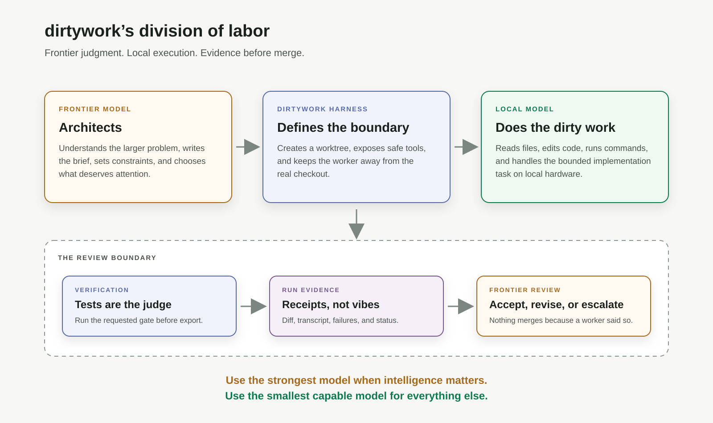

# You Don’t Need a Chainsaw for Every Cut

*Why dirtywork uses frontier models for judgment and local models for execution. Written 2026-08-24.*

I like frontier models. They can hold a large system in their head, reason across
unfamiliar code, spot architectural seams, compare competing approaches, and review a
change with the kind of context that smaller models often lack. When the problem is
difficult or ambiguous, I want the best reasoning available. But I don’t want to use one
for every keystroke.

You don’t need a chainsaw to cut a piece of string. The chainsaw is more powerful — it is
also louder, heavier, more expensive, and a terrible fit for the job. That is the idea
behind dirtywork.

> **Use the strongest model when intelligence materially changes the outcome. Use the smallest capable model for everything else.**

## The false choice

The current conversation often frames AI development as a choice between two extremes:

- Use a frontier model for everything.
- Use local models for everything.

The first option gives you excellent reasoning, but every task carries the cost of a
frontier inference: money, latency, capacity, and energy. The second option gives you
privacy, control, and effectively free marginal usage on hardware you already own — but
local models are not frontier models. They are more likely to lose the thread,
misunderstand a broad request, or make a confident change in the wrong place. The useful
answer is neither extreme; it is to give different models different jobs.



## Frontier judgment, local labor

dirtywork is built around a simple division of labor:

| Role | Responsibility |
|---|---|
| Frontier model | Understands the larger problem, defines the task, reviews the result, decides whether to escalate |
| Local model | Explores the repository, edits files, runs tests, and performs bounded implementation work |
| Harness | Provides isolation, tools, verification, transcripts, and the authority boundary |

The local model does not need to be as good as the frontier model at everything. It
needs to be good enough at a specific, constrained task. “Add tests for these six
functions, follow this existing style, and run this command” is a very different problem
from “redesign the billing system.” The first is a good job for a local worker. The
second deserves frontier attention.

This is not a claim that local models have replaced frontier models. They haven’t. The
point is that replacement is the wrong goal and specialization is the right one.

## The model is not the agent. The harness is.

A model can be helpful without being authoritative, and that distinction is the most
important part of dirtywork. A dirtywork run does not hand a local model the real
checkout and ask it to do whatever seems appropriate. It gives the worker a bounded task,
an isolated worktree, a constrained set of tools, and a place to write its changes. The
worker produces a candidate change, and then the result is inspected:

```text
frontier brief
      ↓
bounded local execution
      ↓
tests and verification
      ↓
diff, transcript, and evidence
      ↓
frontier review
      ↓
accept, revise, or escalate
```

There is no automatic merge. The worker does not get the final word. The run leaves
behind a worktree, a transcript, a diff, and the results of whatever verification was
requested. That changes the question from:

> “Do I trust this model?”

to:

> “What did this model do, and what evidence do I have?”

That is a much more useful question. The [dirtywork README](https://github.com/JimboSchneider/dirtywork)
describes this as frontier models doing the thinking while local models do the dirty
work. The mechanics matter: isolated worktrees, Docker sandboxing, no automatic commits,
resumable runs, review feedback, machine-readable transcripts, and explicit verification
gates. The harness is what turns a model from an authority into a worker.

## Responsible compute

There is a responsible-use argument here, but I want to make it carefully. I am not
claiming that every local model run is automatically greener than every cloud inference —
hardware has an energy cost, manufacturing has a cost, and datacenters can be extremely
efficient at some workloads. The narrower claim is harder to argue with:

> **Unnecessary frontier inference is not free.**

If a local model can safely write a test, update documentation, apply a mechanical
migration, or investigate a bounded failure, there is no reason to send every one of
those steps through the largest available model. Responsible AI should include compute
proportionality:

- Use high-capability models for architecture, ambiguity, and high-consequence decisions.
- Use smaller or local models for bounded, reversible, inspectable work.
- Use ordinary tools for deterministic operations whenever a model is unnecessary.
- Escalate when evidence shows that the worker is stuck or the task has become uncertain.
- Keep a person responsible for what actually merges.

The goal is not to avoid powerful models. It is to stop treating maximum intelligence as
the default setting for every task.

## The economics of review

There is one important constraint: the local worker has to produce a small enough result
that review remains cheaper than doing the work yourself. If a worker changes 400
unrelated files, generates a huge explanation, and leaves you with an archaeological dig,
the economics are gone — you have saved model cost only to spend human attention.

That is why bounded tasks matter. A good delegated task has:

- a clear target;
- a narrow scope;
- explicit non-goals;
- a known verification command;
- a reviewable diff;
- a clear definition of done.

The smaller the review surface, the more useful the delegation becomes. This is also why
dirtywork does not try to make the local worker look autonomous. Autonomy is not the
product; controlled execution is.

## What happened when we actually tried it

The first version of dirtywork was designed, built, reviewed, and shipped using the same
pattern it implements. A frontier model planned the work and reviewed the output, local
models handled the implementation, and the changes went through isolated worktrees and
repeated verification.

The first production run was supposed to add unit tests to an invoicing application. The
local worker did that job successfully. The tests also exposed a real cent-level rounding
bug in invoice math that had been sitting in production.

The local model did not “solve software engineering.” It did something more useful: it
performed a bounded task, produced a visible result, and helped a stronger reviewer find
a problem. That is the shape of work I want from these systems — not magic, receipts.

In another dirtywork development run documented in [What the Meter Said](what-the-meter-said.html),
a local model performed hundreds of turns of repository exploration and implementation
while the frontier side concentrated on planning, review, and cross-task reasoning. The
frontier tokens did not disappear; they moved toward the places where judgment mattered
more.

The receipts are still coming in. Earlier today the released dirtywork — 0.10.1 from
PyPI, not the checkout — built a 1.0 feature on its own repository: the `bash` tool now
accepts a timeout written as `"60s"`, which is what a local model had been sending all
along. qwen3-coder-next did the typing inside the Docker sandbox with the full test
suite as the gate, and Claude wrote the brief and the reviews. Six runs, 188 turns, 4.2
million local tokens, $0, and the suite went from 1,359 tests to 1,386. The reviewer
earned its keep once: the worker’s first cut called `int()` on an unbounded run of
digits, which is a run-ending `ValueError` on Python 3.11 and invisible on the 3.9
machine it was built on — that went back to the worker as feedback and came back fixed.
And the worker earned an asterisk once: handed the pull-request review as feedback, it
called `finish` on its first turn without changing a line, re-declaring the summary from
the run before. A second try got halfway, Claude finished the last two items, and the
[pull request](https://github.com/JimboSchneider/dirtywork/pull/71) says so — as does
the [ledger](https://github.com/JimboSchneider/dirtywork/blob/main/docs/superpowers/bench/2026-08-23-v1-soak-sdd-ledger.md),
next to the numbers.

That is the distinction. We are not trying to remove the expensive model from the
process — we are trying to stop spending its attention on work that does not require it.

## This idea is bigger than dirtywork

The broader pattern is not unique to dirtywork.
[Anthropic describes an orchestrator strategy](https://platform.claude.com/docs/en/about-claude/models/optimizing-for-cost-and-intelligence),
where a stronger model decomposes a task and delegates bounded subtasks to less
expensive workers. [Aider has an architect/editor mode](https://github.com/Aider-AI/aider/blob/main/aider/website/docs/usage/modes.md),
separating high-level reasoning from file-editing execution. Other teams are exploring
local models alongside frontier advisors.

That is good news — it means the industry is beginning to recognize that “one model does
everything” is not the only design. dirtywork’s particular opinion is that the local
worker should be:

- first-class rather than an afterthought;
- model-agnostic;
- isolated by default;
- reviewable after every run;
- measurable through its transcript and verification results;
- allowed to fail without damaging the real checkout;
- escalated when it reaches the edge of its competence.

The interesting product is not simply a router that chooses a model. It is a system that
knows what authority to give that model.

## Proportional intelligence

I don’t want dirtywork to become another chat interface with a terminal attached — I want
it to become an execution layer for a more deliberate kind of software work. The frontier
model should be able to say:

> “This is the problem. This is the bounded piece of it. These are the constraints. This is how we will know whether the result is correct.”

The local model should be able to say:

> “I inspected the files, made the change, ran the checks, and here is exactly what happened.”

The harness should be able to say:

> “Here is the diff. Here is the transcript. Here is the verification result. Nothing has merged.”

That division of labor is not anti-frontier, it is pro-judgment; not anti-AI, it is
pro-appropriate-tool. And it is not about pretending that local models are perfect — it
is about designing a system where they can be useful without having to be perfect.

> **Frontier judgment. Local labor. Deterministic evidence. Responsible compute.**

You don’t need a chainsaw for every cut. Sometimes the right tool is already running on
the machine beside you.

---

*Drafted with ChatGPT from my notes; fact-checked and reviewed with Claude (Fable 5); edited by me.*

*dirtywork is open source at [github.com/JimboSchneider/dirtywork](https://github.com/JimboSchneider/dirtywork).
Contributions, model reports, benchmarks, and real-world failure stories are welcome.*
